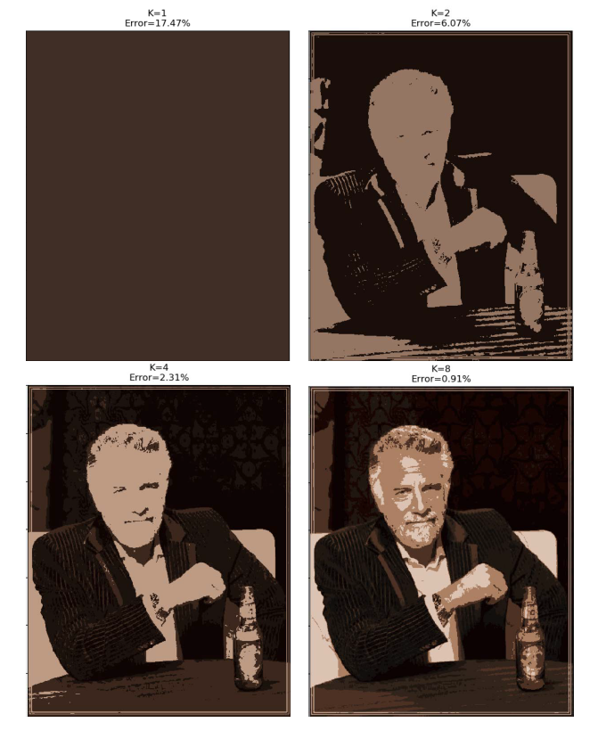
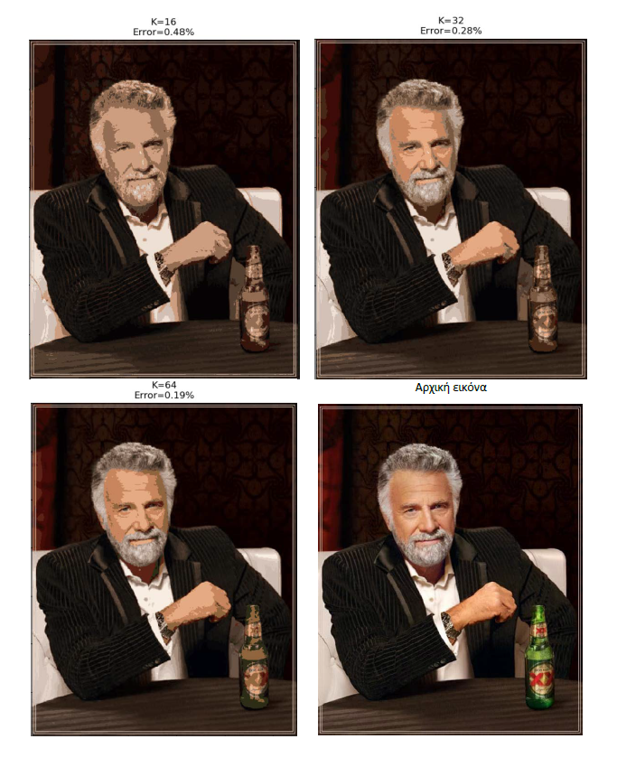

# EM-GMM
Implementation of the Expectation-Maximization algorithm for Gaussian Mixtures from scratch (using NumPy). Some tricks are also used for numerical stability. Part of my 8th semester Machine Learning course project.

## Image compression example
Input image:\

Compressed image:\

